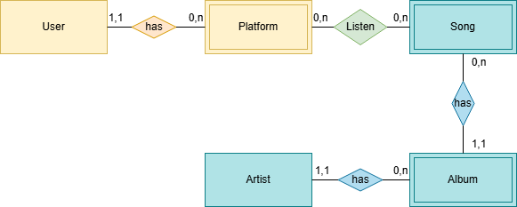

# Spotify Database

A relational database built from Spotify Extended Streaming History exports.

The project parses Spotify's JSON streaming history and organizes the data into a relational schema using MySQL and SQLAlchemy. The database separates artists, albums, songs, listening platforms, users, and individual listening events.

## Project structure

```text
spotify-db/
├── docs/
│   └── simplified_ER_schema.png
├── src/
│   ├── config.py
│   ├── database.py
│   ├── models.py
│   └── parser.py
├── scripts/
│   └── create_database.py
├── .env.example
├── .gitignore
├── requirements.txt
└── README.md
```

### `src/`

* **`config.py`** — loads database, user, and input file configuration from environment variables.
* **`parser.py`** — loads the Spotify JSON export and transforms it into the tables used by the database.
* **`models.py`** — defines the database schema using SQLAlchemy ORM models.
* **`database.py`** — handles database creation, table creation, and data insertion.

### `scripts/`

* **`create_database.py`** — runs the complete pipeline to create and populate the database from a Spotify export.

### `docs/`

* **`simplified_ER_schema.png`** — simplified Entity-Relationship diagram of the database schema.

### Configuration files

* **`.env.example`** — template showing the environment variables required by the project.
* **`.gitignore`** — excludes local environment files, virtual environments, and Python cache files from version control.

## Database schema

The database currently consists of the following tables:

* `users`
* `artists`
* `albums`
* `songs`
* `platforms`
* `listens`

The simplified Entity-Relationship schema is shown below:



## Requirements

* Python 3
* MySQL Server
* Python packages listed in `requirements.txt`

Install the Python dependencies with:

```bash
pip install -r requirements.txt
```

A running MySQL Server installation is also required.

## Configuration

The project uses environment variables for database credentials and other machine-specific settings.

The following variables are supported:

```text
SPOTIFY_DB_USER
SPOTIFY_DB_PASSWORD
SPOTIFY_DB_HOST
SPOTIFY_DB_NAME
SPOTIFY_JSON_PATH
SPOTIFY_USERNAME
```

An example configuration is provided in `.env.example`.

The current implementation reads these values directly from the environment. The `.env.example` file is provided as a template and is not loaded automatically.

## Usage

After configuring the required environment variables, run:

```bash
python -m scripts.create_database
```

The script validates the required configuration, creates the MySQL database if it does not already exist, creates the database tables, and imports the parsed Spotify data.

## Planned features

### Database updates

Add `update_database.py` to support importing new Spotify Extended Streaming History exports without rebuilding the database from scratch.

The update process will identify new artists, albums, songs, platforms, and listening events and add only the data that is not already present.

### Data exploration and visualization

Add notebooks for exploring the resulting database and analyzing listening habits through statistics and visualizations.

Planned analyses include:

* Listening activity over time
* Most played artists, albums, and songs
* Listening duration and playback patterns
* Platform usage
* Temporal listening patterns
* Other statistics derived from the relational database

## Work in progress

This project is currently being developed as a personal data engineering and analysis project. The database creation pipeline is implemented, while incremental database updates and data exploration/visualization notebooks are planned.
